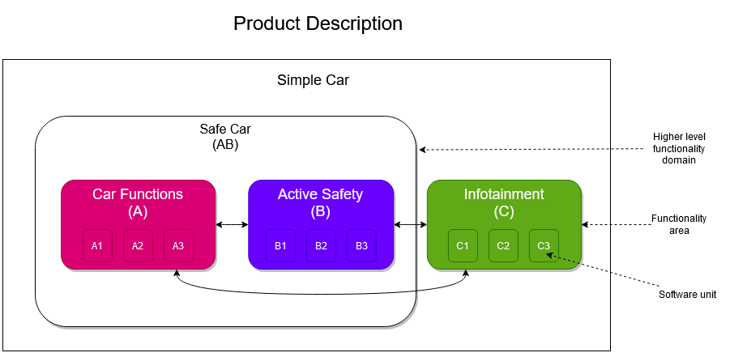
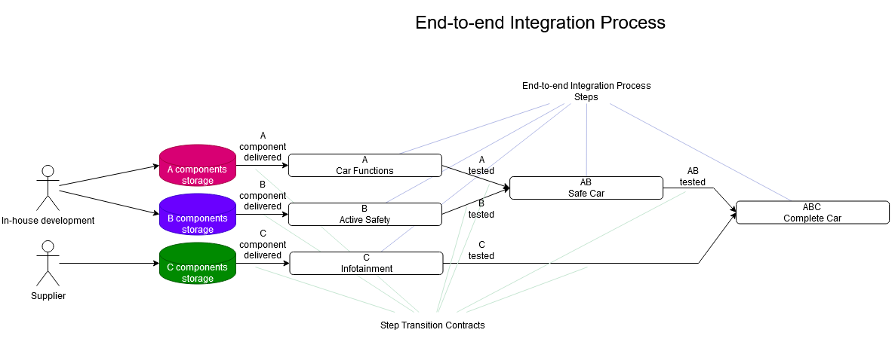
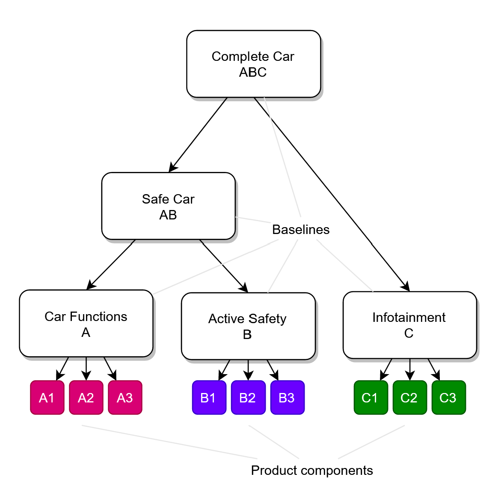
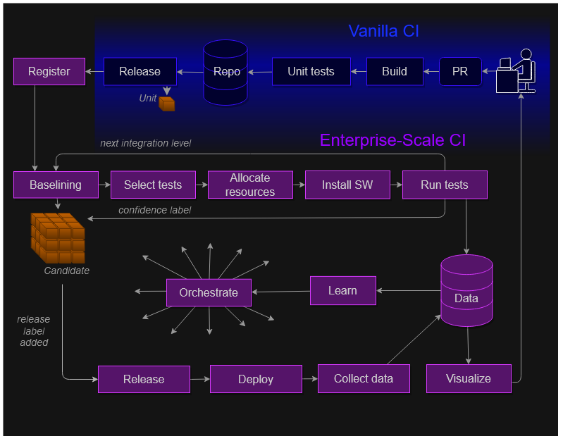

<!--
Licensed to the CD Foundation (CDF) under one
or more contributor license agreements.  See the NOTICE file
distributed with this work for additional information
regarding copyright ownership.  The CDF licenses this file
to you under the Apache License, Version 2.0 (the
"License"); you may not use this file except in compliance
with the License.  You may obtain a copy of the License at

  http://www.apache.org/licenses/LICENSE-2.0

Unless required by applicable law or agreed to in writing,
content distributed under the License is distributed on an
"AS IS" BASIS, WITHOUT WARRANTIES OR CONDITIONS OF ANY
KIND, either express or implied.  See the License for the
specific language governing permissions and limitations
under the License.
-->

## Disclaimers and notes

* The content of this document, and related media, are in **Draft** status, and is work-in-progress
* The content of this document is **input to**, not a proposal _to_ or _from_, the Events in CI/CD workgroup/SIG.
* This document only provides an **overview** of the concepts described therein, and more information about any concept can be supplied (or created) if desired.

"Enterprise-Scale CI" (ESCI) is the working title of a series of concepts, strategies and solutions for continuous integration of
complex multi-component products using multi-level integration processes. It is **not** a one-size-fits-all solution for all types of CI/CD.
While we (doWhile) believe it can be applied to most CI flows, ESCI (and similar strategies) has mainly been used and/or observed by us for CI of products that involve multiple hardware units running software (e.g. telecom backbone, autonomous drive vehicles etc.). 

This means many of the concepts described in this document might seem like "overkill" for many use cases, which is acceptable and expected.

# Enterprise-scale CI

This page lists, by category and alphabetically, several concepts and terms used in Enterprise-Scale CI

- [Enterprise-scale CI](#enterprise-scale-ci)
  - [High-level concepts](#high-level-concepts)
    - [End-to-end Integration process](#end-to-end-integration-process)
    - [Multi-component products](#multi-component-products)
    - [Multi-level integration](#multi-level-integration)
    - [Flows](#flows)
  - [Main entities](#main-entities)
    - [Activity Framework](#activity-framework)
    - [Artifact](#artifact)
    - [Automation Server](#automation-server)
    - [Automation Worker](#automation-worker)
    - [Baseline](#baseline)
    - [Baseline Component](#baseline-component)
    - [Confidence Label](#confidence-label)
    - [Fault](#fault)
    - [Flow Activity](#flow-activity)
    - [Flow Activity Block](#flow-activity-block)
    - [Flow Start Events](#flow-start-events)
    - [Flow Trigger](#flow-trigger)
    - [Resource](#resource)
    - [Resource Set](#resource-set)
    - [Test Automation Framework](#test-automation-framework)
    - [Test Activity](#test-activity)
    - [Test Case](#test-case)
  - [ESCI Flow Steps](#esci-flow-steps)
    - [Component Change](#component-change)
    - [Build](#build)
    - [Unit Test](#unit-test)
    - [Merge](#merge)
    - [Component Release Packaging](#component-release-packaging)
    - [Component Release Registration](#component-release-registration)
    - [Baselining](#baselining)
    - [Test Selection](#test-selection)
    - [Resource Allocation](#resource-allocation)
    - [Test Preparation](#test-preparation)
    - [Test Execution](#test-execution)
    - [Pre-release Data Collection](#pre-release-data-collection)
    - [Next Integration Level](#next-integration-level)
    - [Release Packaging](#release-packaging)
    - [Deployment Automation](#deployment-automation)
    - [Post-release Data Collection](#post-release-data-collection)
    - [Data Visualiztion](#data-visualiztion)
    - [Data Analyics and Learning](#data-analyics-and-learning)
    - [Automation-of-Automation / Orchestration](#automation-of-automation--orchestration)

High-level concepts
-------------------

### End-to-end Integration process

End-to-End Integration Process (EEIP) is a process by which a multi-component product is **built**, **combined** and **verified**. An EEIP is often composed of multiple flows, especially when multi-level integration is part of the strategy.

EEIPs frequently have one end point where the final product is released, but several starting points, typically for each product component when new commits are sent for review or merged to the main branch or when a 3rd party component supplier makes a delivery.

* * *

### Multi-component products

Products that consist of more than one component, where “component” either refers to a software component (e.g. a library, boot-loader, front-end or other software component), a hardware component, or some form of configuration.

**Examples** of multi-component products:

*   Computers & cell-phones (CPU, memory, screen, charger, drivers, operating system, boot configuration, installed applications etc.)
    
*   Cars (break system, steering system, infotainment unit, software modules, variant configuration, boot-loaders etc.)
    
*   Mobile base stations (digital units, radio units, antenna tilt control, load modules, configuration etc.)
    

**Common issues** related to developing, testing and managing multi-component products:

*   Having multiple variants of the product, and not feasibly being able test every variant fully.
    
*   Not knowing what versions of what components are part of a customer release, and how those versions have been tested.
    
*   Needing to “recall” one version of a component, and not being able to say where it is being used.
    

**Related concepts**: Baselining

* * *

### Multi-level integration

For many multi-component products it is possible, and often desired, to test parts of the product separately before assembling and testing the end product. For example, components can be tested individually first, then included in component groups and tested, and finally included in the end product and tested.

Discovering issues in earlier integration-levels help avoid costly troubleshooting in later levels, when the complexity is higher.

TODO: Add more info here, it feels too short.

**Examples** of multi-level integration:

*   Computer/cell-phone: First, test the CPU separately. Then, group it with other components on the motherboard/mainboard and test that group. Then put the board in a computer/cell-phone with an operating system and test that.
    
*   Car: Test the left-rear break separately. Then connect it to the breaking system and test that system. Then put the breaking system in a car and test the whole thing.
    

**Common issues** related to performing multi-level integration:

*   Understanding when a release/version from an earlier integration level is ready to be used.
    
*   Tracking the changes/differences between two later-level integration releases.
    
*   When things break in a later integration level, it takes a lot of time before the fault information makes it to the component team that can fix the issue.
    

**Related concepts**: Baselines, Confidence Labels, Shift-Left

* * *

### Flows

An ESCI flow is an interconnected set of (mostly) automated activities that produces some form of value.

*   “Interconnected” in this context means activities often use what earlier activities have produced (information, files, test environment states etc.),
    
*   “(mostly) automated” implies that while a high degree of automation in flows is desired, it is sometimes appropriate to have manual activities as part of the flow.
    
*   “some form of value” is intentionally vague, but common types of value produced include:
    
    *   Baseline component versions and baseline versions
        
    *   Test results and confidence labels
        

Activities in a flow run in sequence or in parallel depending on the needs.

TODO: Insert explanatory picture here

A flow is typically started when some form of event occurs, based on the definition of the flow “triggers”.

Flow starting events could include:

*   A code change is sent for review
    
*   A delivery from an external supplier is received
    
*   A baseline version has gotten a certain successful confidence label
    
*   A new test case is created
    
*   A test environment is modified
    
*   A new version of some part of the verification toolchain is released
    

**Examples** of flows include:

*   Component gate flow: Start on code change → run static code analysis → run unit tests → verify that the code compiles → report back to the code change
    
*   Component release and verification flow: Start on merge to main branch → build component → register new baseline component version → build new “single-component” baseline → install baseline on test environment → run tests → report confidence label
    

Flows can be considered to be of many different types, including:

*   Build & integration flows - Produces component releases, baselines and test results.
    
*   Verification flows - Produces test results and verification data.
    
*   Data flows - Consumes data and produces other data and/or metadata about the original data.
    
*   Machine-learning flows - Consumes data and produces trained machine-learning models.
    
*   Release & Deployment flows - Packages the product for release, and deploys it to relevant targets.
    

**Common issues** with creating, running and maintaining flows:

*   Hard to keep track of the infrastructure and services that must be operational for flows to be able to run, so flows frequently break or stop
    
*   Flows are complex, so changes to the flow often breaks it, or creates issues for others working on the flow
    
*   The flow infrastructure is complex, so people who want to get started creating flows have a very large amount of knowledge to build first
    

**Related concepts:** TODO

* * *

Main entities
-------------

This section describes some important entities, and what their desired features are, in an ESCI setting.

### Activity Framework

The Activity Framework helps users create, configure and run Flow Activities.

**Desired features** of an activity framework include:

*   Activities are developed using a rich activity development API and activity harness that takes case of most common activity needs (parameters, errors, callbacks etc. etc.)
    
*   Activities can be selected and configured through well-structured external configuration files
    
*   When running activities, a lot of data is produced, both data that can be used by later activities and data that shows the result/outcome of running the activity
    
*   Environment-dependent set-up, reset and tear-down code can be turned on and off at will through extensions
    

**Examples** of Activity Frameworks:

*   doWhile DWCX Autor
    
*   Volvo Cars Volare framework
    

* * *

### Artifact

An artifact represents a file together with additional metadata. Artifacts are typically used for files that we want to have a permanent reference to, such as built software, documents, releasable configuration files etc.

Artifact files are often, but not always, the result of building or transforming content in a source repository, but may also be deliveries from an external supplier, crash reports from running software etc. etc.

Metadata can be connected to artifacts. This metadata includes data connected to the file itself, such as checksums, but could also include data connected to the production or usage of the file, such as a link to the build job that produced it, a list of product variants supported by the file, or the number of times it has been downloaded.

Artifacts are typically stored on and managed by an Artifact Server, such as Artifactory or Nexus.

**Examples** of Artifacts:

*   Built software applications or modules
    
*   Transformed configuration files (normally, configuration files are under source control)
    
*   Documents
    

* * *

### Automation Server

An automation server runs jobs on demand or on a schedule, typically as part of automation flows.

In event-and-trigger-based ESCI flows, automation servers only run individual jobs when requested, as the “flow drive” is controlled by trigger definitions. In automation-server-based flows, the pipeline functionality of the automation server itself defines and drives the flow.

**Examples** of Automation Servers:

*   [Azure Pipelines](https://azure.microsoft.com/en-us/services/devops/pipelines/)
    
*   [Concourse-CI](https://concourse-ci.org/)
    
*   [Jenkins](https://www.jenkins.io/)
    

* * *

### Automation Worker

Automation Workers are typically physical machines, virtual machines or containers that run automation jobs for an Automation Server. Typically these Workers fall into one of two categories: Either they are reasonably generic workers, that can run many types of activities such as building and baselining, or they are workers connected to Resource Sets, and are used to run specific verification or deployment activities.

* * *

### Baseline

A baseline acts as a blueprint for the components (Baseline Components) that make up a product. These components can be hardware, software, configuration, scripts, documentation etc., that are meaningful to consider as one group.

Based on the baseline blueprint, baseline **versions** are created, which are concrete selections of versions/releases for the components of the blueprint, and typically form an installable and/or shippable package that is used for internal verification, deployment, customer release etc.

For baselines that are intended to be installed on some physical or virtual node (e.g. a set of software units for a vehicle break controller, or a firmware update for a phone), they may declare a “target component” to indicate the node they are intended to run on.

In Multi-Level Integration, baselines for later integration levels frequently include baselines from earlier integration levels, making these later-level baselines “baselines-of-baselines”, and their versions a selection of earlier-level baseline versions. Typically the selection of these earlier-level baselines is done by searching for interface-compatible baseline versions with sufficient successful Confidence Label results.

* * *

### Baseline Component

A baseline component represents entities of which releases/versions can be created for the purpose of being part of one ore more packages (baseline versions), or the target of baseline versions.

Examples of components, and their corresponding component versions, include:

**Component**|**Component Versions**
:---|:---
Software libraries (e.g. libcurl)|Built binary versions of the library (e.g. `libcurl-2.1.10`)
Configuration (e.g. “configuration for vehicle break system for US market”)|Revisioned configuration files (e.g. `break-system-us.yaml@f44e2b1`)
Hardware units (e.g. Razer Naga computer mouse)|Version of hardware unit (e.g. “Razer Naga Production Pre-Sample B”
Documentation (e.g. Ubuntu 20.10 Groovy Gorilla release notes)|Revision of document (e.g. `ubuntu-groovy-gorilla-release-notes-draft-4.pdf`)

In most scenarios, baseline component versions are created by building/transforming one or more source files (e.g. source code for software component versions, CAD for hardware component versions). To be able to connect an end product all the way to the source files that was used to create it, a baseline component can be connected the repositories (e.g. a Git repository) these source files can be found in, and a baseline component version can be connected to the versions/revisions (e.g. commits) of these repositories were used.

Some component types (e.g. software libraries and hardware units) may provide or use interfaces to/from other components. This implies a specific component version may or may not be compatible with other component versions, depending on the interface versions they user or provide.

Write a section on interfaces and interface compatibility somewhere, and link it from here.

* * *

### Confidence Label

Commonly, the purpose of verification in product development is to build confidence that a version/release of the product (or component of the product) works.

It is often not sufficient to have just a global “works fully or not” statement during the development of a product (even though it might be sufficient for the customer release), ESCI promotes use of several Confidence Labels for the product, and for its smaller parts (if applicable).

Examples of confidence labels, for a computer, could be:

*   Sanity verified - Can be started and run simple operations for 10 minutes
    
*   Robustness verified - Can restart, shutdown+start, sleep+resume 10.000 times
    
*   Stability verified - Can run a set of heavy usage scenarios for 148 hours straight
    
*   Peripheral compatibility verified - A standard set of peripherals (mouse, keyboard, printer etc.) can be connected, used and disconnected normally.
    

For each of these confidence labels (which apply to baselines), results can be produced (which apply to baseline versions). A confidence label result can be either **passed** (indicating that verification was performed and was successful), **failed** (indicating that verification was attempted but failed), or not present (indicating that verification has not been performed yet). Furthermore, a confidence label result may hold references to the results of test activities or other activities that contributed to the confidence label result.

The product development organization can then build flows, hand-overs, release gates etc. around these confidence label results, for instance:

*   When a new baseline version is created, we start with the sanity verification before we start other activities.
    
*   Peripheral compatibility testing should be run on baseline versions that have successful confidence label results for Sanity verified and Robustness verified.
    
*   A baseline version is ready for inclusion into later-level baseline versions when successful confidence label results for Robustness, Stability and Peripheral verification have been added.
    
*   Stability verification should be run on baseline versions even if they have failing peripheral compatibility confidence label results, as the stability verification does not use peripherals.

Confidence labels can be used to form “contracts” between different teams and organizations, often to show when a team or organization is ready for some other team or organization to “take in” a new baseline version.

In the case where the results of multiple confidence labels are meaningful together, a hierarchy of confidence labels can be defined, where the result of “parent” confidence labels are set as successful when all “child” confidence labels are successful, and are set as failed when any child has failed. These parent confidence label results can then be what other teams look for when deciding whether to use a baseline version or not.

* * *

### Fault

ESCI Flows are commonly run with at least a partial purpose of identifying faults in the components and products being tested. Also, the addition of and changes to test cases, test environments and general infrastructure run and used by ESCI flows will likely cause faults to appear that are not faults in the product.

In ESCI, a Fault Classification strategy is used to provide additional information and context to faults, with the goal of being able to categorize the fault into, for example, one of the following high-level fault domains:

*   Product fault - A fault in one of the components or products being built and verified.
    
*   Configuration fault - A Flow Activity, Test Method or similar has been configured by a user in a way that caused a fault.
    
*   Programming fault - A Flow Activity, Test Method or similar has been implemented in a way that causes a fault.
    
*   Resource fault - A Resource in a test environment, simulation environment or similar caused a fault.
    
*   Infrastructure fault - The infrastructure (network, storage, power etc.) on which ESCI flows run has caused a fault.
    

Further domain-specific categorization and other additional information can also be connected to a fault.

In the ESCI Fault Classification Strategy, there are three “layers” where such fault classification information can be added:

1.  At origin: The code that throws/raises the exception sets the fault domain and other information.
    
2.  Run-time: The application that runs the code that throws/raises the exception catches it and adds additional information before reporting it remotely
    
3.  Post-processing: The service that receives the reported fault analyzes the fault and related data (logs etc.) to add additional information to the fault.
    

**Examples** of faults:

*   A component doesn’t come back up after a restart.
    
*   A Flow Activity has been configured to create a baseline version for a baseline that does not exist.
    
*   A Test Method attempts to send an remote command before connecting the remote session.
    
*   A simulator in a test environment crashed during the test execution.
    
*   A Flow Activity was unable to download an Artifact because the network is down.
    

* * *

### Flow Activity

An ESCI Flow Activity is a set of instructions/steps (typically implemented by a reusable activity module/class in an activity framework) and configuration that, when run, produces some form of value to the flow or to users interested in the flow.

A flow activity often receives both “dynamic input” from previous activities in the flow, or from a flow starting event, such as what commit to act on, or what baseline version to use for testing, as well as “static input” from configuration files, such as what to name the resulting binary or what test activity to run.

When a flow activity is run, it typically produces two types of output: results and data needed by (used as “dynamic input” for) later flow activities.

**Examples** of Flow Activities:

*   Build and register component
    
*   Create new baseline version
    
*   Deploy baseline version to staging environment
    
*   Verify baseline version and set confidence labels
    

* * *

### Flow Activity Block

A Flow Activity Block groups together flow activities that need to, or are beneficial to, run on the same automation worker, for instance if one activity sets the worker, or resources connected to a worker, in a specific state that later activities in the same activity block need to use.

A common usage for activity blocks is when one early activity deploys a baseline version to a connected resource and later activities run various test automation activities or log collection activities on said resource, ending with an activity that sets a confidence label based on the results of earlier activities.

In ESCI, flow activity blocks have a one-to-one relationship with automation server jobs, meaning each activity block is run by its own job.

**Examples** of Flow Activity Blocks

*   Install component software + Run automated tests + Collect and upload logs
    
*   Configure and run simulator + Post-process local simulator logs
    

* * *

### Flow Start Events

A Flow always has one or more reasons to start running, ranging from source code changes and supplier deliveries, to a previous Flow having produced something interesting (e.g. a confidence label or a piece of data).

When something happens that should cause a Flow to start, this is referred to as a Flow Start Event, and one or several Flow Activity Blocks have this Flow Start Event set as their trigger criteria for starting.

**Examples** of Flow Start Events:

*   Product code review merged.
    
*   Test case code review merged.
    
*   Supplier delivery received.
    
*   Timer (e.g. “Start this activity block every weekday at 2AM”).
    
*   Successful Confidence Label set on a relevant Baseline.
    

* * *

### Flow Trigger

Triggers in a Flow are the rules that control when Activity Blocks in the Flow are started.

Triggers can be of two types: Flow Start Events or Flow Continuation Events. Flow Start Events are typically either “hand-overs” from a previous flow (often confidence label set), or external events. See Flow Start Events for details.

Flow Continuation Events are used in event/trigger-based Flows to control the execution-flow of the Activity Blocks in the flow (e.g. “when block A is done, start blocks B and C” or “if activity X fails, start block Z”).

* * *

### Resource

A Resource is a piece of hardware, software or similar that we need to interact with, or know about, when we run Flow Activities or Test Cases.

Every resource has an identifier (e.g. “power-switch-4”), which may be unique across all resource sets, but must at least be unique inside the resource set it is part of.

Every resource also has a type (e.g “XYZ remote power switch”), that controls what Resource Representation class (in code) is used to provide interaction with the resource when needed in Flow Activities or Test Cases.

Resources may have one or more “tags”, which mainly provide information about what purpose the resource serves (e.g. the tags “primary” on one resource and “secondary” on another resource could be used in redundant setups).

Configuration for resources, such as host-names, ports, usernames and passwords are provided through Resource Set configuration.

* * *

### Resource Set

Resource Sets are collections of Resources representing, typically, a physical or virtual environment used for testing, deployment or other automation activities.

When an Activity Framework or Test Automation Framework is run, they may be given the ID or configuration of the Resource Set they will operate on (usually connected to whatever machine they are running on at the time) so that when Test Cases or Flow Activities request resources, the framework will locate them in the Resource Set and load the appropriate Resource Representation class.

In automation flows the Flow Activity Block may declare their selection criteria for the Resource Set they can run on, using different strategies depending on the needs.

In simple scenarios, the ID for the Resource Set is set as the selection criteria, meaning the Flow Activity Block will only run on that specific Resource Set.

In scenarios where multiple identical, or nearly identical, environments are built (e.g. for scaling up throughput), the corresponding Resource Sets may be put in a Resource Set Pool, and the ID of this pool is set as the resource selection criteria for the Flow Activity Block.

In more dynamic scenarios, each Resource Set may declare a set of Capabilities it supports (a capability may for instance indicate that a certain type of simulator is part of the Resource Set, or that a certain product variant or configuration is available in the Resource Set). Flow Activity Blocks may then declare a list of capabilities as its selection criteria, causing a capability matching algorithm to be executed in the Resource Allocation flow step to locate a matching and available Resource Set.

A Resource Set usually has a corresponding configuration “document” (e.g. a file or a database entry) that contains configuration for all Resources in the Resource Set. This configuration may partly come from “shared configuration” for Resources that are accessible and used from multiple environments (such as central Artifact Servers).

* * *

### Test Automation Framework

A Test Automation Framework helps users develop and run automated tests. While conceptually similar to an Activity Framework, a Test Automation Framework is more focused on running mostly standalone tests and producing test results and measurements/data to verify that products and product components work.

Desired features of a Test Automation Framework are similar to those of an Activity Framework, such as being externally configurable, extensible and scalable, producing lots of data, and acting as a harness that makes the development of automated test cases more manageable.

**Example** Test Automation Frameworks:

*   Several extensible “unit-testing-style” frameworks such as xUnit.net, GoogleTest, JUnit etc.
    
*   Robot Framework
    
*   Gauge
    
*   doWhile DWCX doTest
    

* * *

### Test Activity

Test Activities control what will be executed during a run of a Test Automation Framework, and how.

In Test Case-based frameworks, a Test Activity typically selects and parameterizes one or more Test Cases and organizes them into Test Suites, whereas in more “Scenario-based” frameworks, a Test Activity may select and parameterize a single scenario run (which, for data model simplicity reasons, may be seen as a single test case).

The Test Activity configuration may also control what extensions should be activated in the Test Automation Framework, as well as provide configuration to product-integration utility functions.

* * *

### Test Case

A Test Case typically represents a configured execution of some form of Test Method. A Test Method in this context may be a programming language method (common in unit-test-style testing), a set of keywords (in BDD-style testing) or some type of scenario. The Test Method commonly takes parameters that control its behavior, making it reusable for several Test Cases (e.g. a restart test method configured with one restart is a feature test, with 20 restarts is a robustness test and with 1000 restarts is a long-term stability test).

* * *

ESCI Flow Steps
---------------

### Component Change

TBW

* * *

### Build

TBW

* * *

### Unit Test

TBW

* * *

### Merge

TBW

* * *

### Component Release Packaging

TBW

* * *

### Component Release Registration

TBW

* * *

### Baselining

TBW

* * *

### Test Selection

TBW

* * *

### Resource Allocation

TBW

* * *

### Test Preparation

TBW

* * *

### Test Execution

TBW

* * *

### Pre-release Data Collection

TBW

* * *

### Next Integration Level

TBW

* * *

### Release Packaging

TBW

* * *

### Deployment Automation

TBW

* * *

### Post-release Data Collection

TBW

* * *

### Data Visualiztion

TBW

* * *

### Data Analyics and Learning

TBW

* * *

### Automation-of-Automation / Orchestration

TBW
